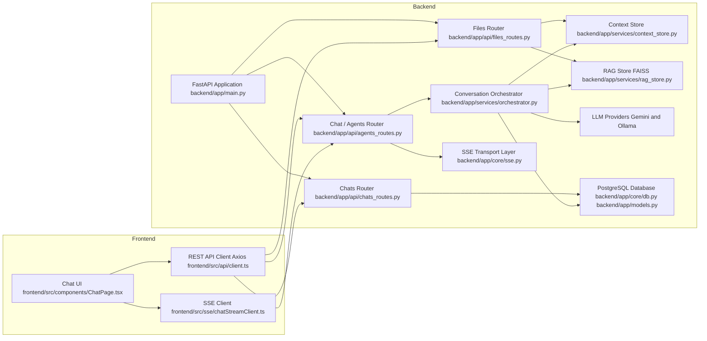

# AI Chatbot (FastAPI backend + React TS frontend)

Monorepo for a streaming chat app with file uploads and optional RAG. Frontend is React + Vite; backend is FastAPI with SSE and providers for Gemini or local Ollama.

- Frontend: [frontend/](frontend)
  - App entry: [frontend/src/main.tsx](frontend/src/main.tsx), routes in [frontend/src/App.tsx](frontend/src/App.tsx)
  - Streaming client: [frontend/src/sse/chatStreamClient.ts](frontend/src/sse/chatStreamClient.ts)
  - API client: [frontend/src/api/client.ts](frontend/src/api/client.ts)
  - Chat UI: [frontend/src/components/ChatPage.tsx](frontend/src/components/ChatPage.tsx)
- Backend: [backend/app/](backend/app)
  - FastAPI app: [backend/app/main.py](backend/app/main.py)
  - Agents (SSE, prefs, history): [backend/app/api/agents_routes.py](backend/app/api/agents_routes.py)
  - Chat CRUD + messages: [backend/app/api/chats_routes.py](backend/app/api/chats_routes.py)
  - File upload: [backend/app/api/files_routes.py](backend/app/api/files_routes.py)
  - RAG store: [backend/app/services/rag_store.py](backend/app/services/rag_store.py)
  - Orchestrator (providers, RAG prompt, DB persist): [backend/app/services/orchestrator.py](backend/app/services/orchestrator.py)
  - Settings: [backend/app/core/settings.py](backend/app/core/settings.py)

---

## Core functionalities
1. User can send text messages and receive AI responses
2. User can upload a file (PDF/TXT/CSV)
3. User can ask questions about the uploaded file content
4. Conversation history is maintained within the session

## Technologies
1. Frontend: React with TypeScript
2. Backend: Python (FastAPI)
3. LLM: Ollama and Gemini
4. File parsing: PyPDF2, pandas

## Features
1. Streaming responses
2. Conversation persistence

---

## Prerequisites

- Node.js 18+ and npm
- Python 3.13+ (virtualenv recommended)
- PostgreSQL (DATABASE_URL required)
- Optional:
  - Gemini API key for LLM and embeddings
  - Ollama (local LLM), e.g. `ollama pull llama3.2`

---

## Backend setup

### 1) Create venv and install dependencies:

```bash
cd backend
py -3.13 -m venv venv
```

#### Windows:
```bash
.venv\Scripts\activate
```
#### macOS/Linux:

```bash
source .venv/bin/activate
```

```bash
pip install -r requirements.txt
```

### 2) Configure environment variables
```bash
# Put your GEMINI_API_KEY in .env
```

### 3) Run server
```bash
uvicorn app.main:app --reload --host localhost --port 8000
```

## SSE endpoint
POST:
- `http://localhost:8000/api/chat/stream`

---

## Frontend setup

1) Install dependencies

```bash
cd frontend
npm install
```

2) Configure API base (optional)

- Defaults to http://localhost:8000 via [frontend/src/api/client.ts](frontend/src/api/client.ts).
- To override, define VITE_API_BASE (e.g., in a local env file):

```env
# frontend/.env (not committed)
VITE_API_BASE=http://localhost:8000
```

3) Run dev server

```bash
npm run dev
```

Build/preview:

```bash
npm run build
npm run preview
```

## How it works

- The UI posts messages to `/api/agents/stream` via SSE (see [frontend/src/sse/chatStreamClient.ts](frontend/src/sse/chatStreamClient.ts)).
- The backend [orchestrator](backend/app/services/orchestrator.py) builds a context-aware prompt using:
  - Recent chat history (DB or in-memory)
  - Uploaded file text and top-k RAG snippets (if Gemini embeddings available)
- Providers:
  - Gemini via [GeminiProvider](backend/app/services/providers_gemini.py)
  - Ollama via [OllamaProvider](backend/app/services/providers_ollama.py)
- File uploads (PDF/TXT/CSV) populate context and optional FAISS index (requires `GEMINI_API_KEY`) in [rag_store](backend/app/services/rag_store.py).

---

## Architecture decisions
- Frontend renders chat UI and streams tokens via SSE to keep UX responsive.
  - Streaming client: [`frontend.src.sse.chatStreamClient`](frontend/src/sse/chatStreamClient.ts)
  - API client: [`frontend.src.api.client`](frontend/src/api/client.ts)
  - Chat page: [`frontend.src.components.ChatPage`](frontend/src/components/ChatPage.tsx)

- Backend exposes REST + SSE, orchestrates providers, persists chats/messages to DB, and optionally does RAG over uploaded content.
  - App setup, CORS, metrics: [`backend.app.main`](backend/app/main.py)
  - Orchestration: [`backend.app.services.orchestrator`](backend/app/services/orchestrator.py)
  - Providers: Gemini [`backend.app.services.providers_gemini`](backend/app/services/providers_gemini.py), Ollama [`backend.app.services.providers_ollama`](backend/app/services/providers_ollama.py), LangChain variants [`backend.app.services.providers_langchain`](backend/app/services/providers_langchain.py)
  - SSE helpers: [`backend.app.core.sse`](backend/app/core/sse.py)
  - RAG store (FAISS + embeddings): [`backend.app.services.rag_store`](backend/app/services/rag_store.py)
  - Chats/messages DB models: [`backend.app.models`](backend/app/models.py)
  - CRUD routes: [`backend.app.api.chats_routes`](backend/app/api/chats_routes.py), file upload: [`backend.app.api.files_routes`](backend/app/api/files_routes.py), agent endpoints: [`backend.app.api.agents_routes`](backend/app/api/agents_routes.py)
  - Settings: [`backend.app.core.settings`](backend/app/core/settings.py), DB: [`backend.app.core.db`](backend/app/core/db.py)

### Diagram



### Key trade-offs

- SSE vs WebSockets for streaming
  - Pros (SSE): simpler, native in browsers, works over HTTP/2, easy server implementation via [`backend.app.core.sse`](backend/app/core/sse.py)
  - Cons: server-to-client only; custom recovery/backpressure needed. WebSockets would allow bidirectional control but add complexity.

- Provider abstraction (Gemini, Ollama)
  - Pros: swap models based on preferences via [`backend.app.services.context_store`](backend/app/services/context_store.py) and [`backend.app.services.orchestrator`](backend/app/services/orchestrator.py)
  - Cons: capability drift across providers; testing matrix grows; need careful prompt normalization.

- RAG optionality
  - Pros: when `GEMINI_API_KEY` is present, embeddings improve relevance via [`backend.app.services.rag_store`](backend/app/services/rag_store.py); when absent, system degrades gracefully.
  - Cons: FAISS is in-memory per session; no persistence, limited scalability; embeddings add latency and cost.

- DB persistence for chats/messages
  - Pros: durable history via [`backend.app.models`](backend/app/models.py) and [`backend.app.api.chats_routes`](backend/app/api/chats_routes.py); enables multi-session continuity.
  - Cons: requires `DATABASE_URL` and migrations; adds infra complexity vs pure in-memory.

- Client-side overlay during streaming
  - Pros: immediate UX feedback combining server data with in-flight UI via [`frontend.src.lib.chatOverlay`](frontend/src/lib/chatOverlay.ts).
  - Cons: reconciliation bugs if server ordering changes; needs careful dedup/merge logic.

- Central system prompt
  - Pros: consistent persona and safety rules in [`backend.app.services.orchestrator`](backend/app/services/orchestrator.py); easier tuning.
  - Cons: risk of prompt bloat; provider token limits; may require per-provider adaptation.

## Further improvements
- Add rate limiting and auth; cache recent chat contexts to reduce DB load.
- Introduce migrations/versioning for models; monitor latency via `/metrics` in [`backend.app.main`](backend/app/main.py).
- Introduce new features: Voice input, Docupedia/Web Search, show resources agent have found
- Figure better ways to manage many models
- Applied LangSmith to provide observability, tracing, and evaluating capabilities for debugging and improving agent quality
- Tests: Jest for frontend and PyTest for backend

---

## Common configs

- CORS is configured in [backend/app/main.py](backend/app/main.py); default allows `http://localhost:5173`.
- Frontend API base is resolved in [frontend/src/api/client.ts](frontend/src/api/client.ts).
- Environment files are ignored by git (keep .env.example tracked if needed).

## Scripts quick reference

- Backend: install/start
  - `pip install -r backend/requirements.txt`
  - `uvicorn app.main:app --reload --port 8000` (from backend/)
- Frontend: dev/build
  - `npm run dev`
  - `npm run build`